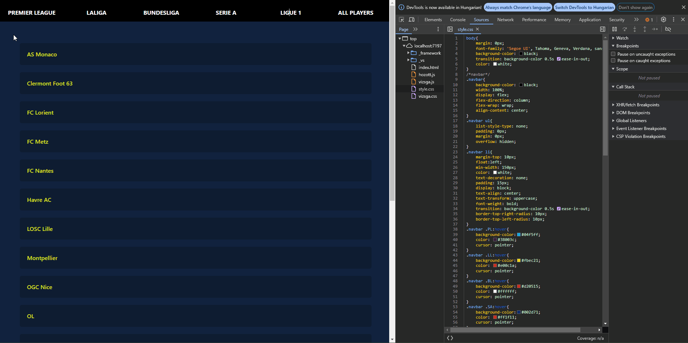

# 2. ZH
__Név:__ *Berki Dávid*

__Neptun:__ *FQ8RLI*

***

## Projekt rövid leírása:

Egy `Web API` és egy `Windows Forms` applikáció a __jelenlegi TOP 5 labdarúgó ligában szereplő csapatok és játékosok megjelenítésére__, valamint tartalmazza az FC24 játékban használt játékos értékeléseket. 

#### Web API: 

>Egy felhasználó van, az `index.html`-en található navigációs gombok lenyomásakor a backend lekéri az `Azure`-ban lévő adatbázisból az adott liga csapatait, vagy az összes játékos adatait. 

#### Windows forms: 

>Az adatok betöltése szintén `Azure` szerveren lévő adatbázison keresztül történik. Az alkalmazásban lehetőség van a játékosok törlésére is. 

## Hozott anyagok:

### Saját Adatbázis


* `3x1p` Az alkalmazásban használt táblánként pont (`teams`, `countries`, `players`)
* `1p` Az adatbázis tartalmaz Constraint-eket (min 2)
    * NOT NULL, PRIMARY KEY, FOREIGN KEY 
* `2p` Az adatbázis saját Azure SQL szerveren van
* `1p` Az adatbázis adatainak forrásmegjelölése értsd: miből készült és hogyan:

> Az adatbázishoz adatait a [Fifa players](https://www.kaggle.com/datasets/joebeachcapital/fifa-players/) és a [Country flags](https://www.kaggle.com/datasets/zhongtr0n/country-flag-urls/data) segítségével gyűjtöttem össze. A két adatbázisban az országok különböző elnevezései (pl. Russia - Russia Federation) problémát okoztak, ezért Excelben elvégeztem az adatok egységesítését. A `players` tábla nem tartalmazta a csapatok ligáit, így azt magamtól gyűjtöttem ki egy harmadik táblába. 
Végül az elkészült .csv állományokat [CSV To SQL Converter](https://www.convertcsv.com/csv-to-sql.htm) segítségével SQL Script-re formáztam. 

Részösszeg: `7p`

### Weboldal


* `1p` A weboldalnak van egy értelmezhető struktúrája
   * A `body` két részre van osztva:
      * A `navbar` lehetőséget ad választani az oldal funkciói között
      * A `main` részt tölti fel adatokkal a `vizsga.js`
* `1p` A weboldal dinamikus tartalommal tölthető fel adatbázison keresztül
* `1p` A weboldal használ legalább 20 sor értelmes css-t
* `1p` A weboldal javascriptje más funkciót is ellát, mint az adatok betöltése
   * A javascript figyeli a navbar gombjainak `mouseout`, `mousein` és `click` eseményeit, és megfelelő színre módosítja a `body` hátterét és szövegszínét. 

Részösszeg: `4p`

__Eddig:__ `11p`

## ZH-n írt anyag:

### Web


* `2p` program.cs beállítása wwwroot mappában tárolt statikus tartalmak megosztására
* `1p` Scaffold-DbContext használata (ajándék)

```
Scaffold-DbContext 'Server=tcp:sqlfc24.database.windows.net,1433;Initial Catalog=FC24;Persist Security Info=False;User ID=b.davve1204;Password=Password12345;MultipleActiveResultSets=False;Encrypt=True;TrustServerCertificate=True;Connection Timeout=30;' Microsoft.EntityFrameworkCore.SqlServer -OutputDir Models -Context fc24Context -Force
```

* `3p` Teljes SQL tábla adatainak szolgáltatása API végponton keresztül
* `2p` SQL tábla egy választható rekordjának szolgáltatása API végponton keresztül

Részösszeg: `8p`

__Eddig:__ `19p`

### Javascript

* `2x5p` (pl: szöveg és kép) DOM feltöltése javascripttel (vizsgán írandó, NEM HOZOTT, aki ezt választja az a hozott anyagba nem rakhatja bele a js kódot amivel feltölti a tartalommal a DOM-ot, tehát ez az előre feltöltött hozott.js-ben nem lehet benne, vizsgán kell megírni egy vizsga.js fájlba.)

Részösszeg: `10p`

__Eddig:__ `29p`

---

#### Windows Forms


* `2p` Az alkalmazásból a kilépés csak megerősítő kérdés után lehetséges.
* `2x2p` Olyan alkalmazás elrendezés, melyben gombok lenyomására UserControl-ok kerülnek elhelyezésre egy Panel vezérlőben, teljesen kitöltve azt. Minden gombra jár a pont, amennyiben az funkcionalitással rendelkező UserControl-t tölt be.
* `2p` Anchorok alkalmazása: az alkalmazás egészében meg van oldva, hogy az ablak átméretezésekor ki legyen használva a rendelkezésre álló terület.
* `2p` tábla adatainak megjelenítése DataGridView-ban
* `2p` A tábla idegen kulcsot is tartalmaz, melynek megjelenítése DataGridViewComboBoxColumn-on keresztül történik. (Összes játékos `userControl`-on)
* `2p` Működő BindingSource (Összes játékos `userControl`-on)
* `2p` Adatok megjelenítése listboxban (Játékosok csoportosítva `userControl`-on)
* `2x2p` Ha az adatok tetszőleges módszerrel, pl. TextBox-on keresztül szűrhetőek. (Játékosok csoportosítva `userControl`-on)
* `2p` Sikeres törlés (Játékosok csoportosítva `userControl`-on)
    * _A törlés csak akkor sikeres, amennyiben a felhasználó az ID oszlopot jelöli ki, máskülönben hibával lép ki az alkalmazás. __Ez lehetséges hiba__._
* `2p` Megerősítéshez kötött törlés

Részösszeg: `24p`

__Összesen:__ `53p`
-
